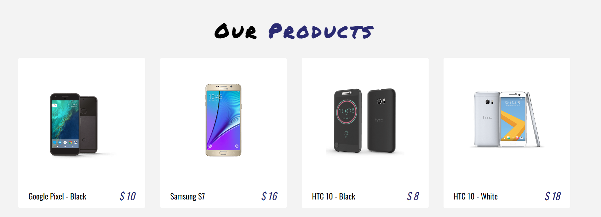

Check out the live demo: [https://tejas-phone-shope.netlify.app/](https://tejas-phone-shope.netlify.app/)
# E-Phone-Store



## Description

E-Phone-Store is a responsive e-commerce website built with ReactJS, Bootstrap, and Styled Components. It features a range of mobile phones, including their images, names, prices, and descriptions. The user can add the phone to their cart and proceed to checkout. The checkout process involves filling out personal information and payment details.

## Demo


## Installation

1. Clone the repository:

```bash
git clone https://github.com/your-username/E-Phone-Store.git
```

2. Install the dependencies:

```bash
npm install
```

3. Run the app:

```bash
npm start
```

4. Open the app:

```bash
http://localhost:3000/
```

## Features

- Responsive design
- Mobile-friendly
- Product listing
- Product details
- Add to cart
- Remove from cart
- Cart total calculation
- Checkout form validation
- Payment gateway integration

## Technologies

- ReactJS
- Bootstrap
- Styled Components
- React Router
- React Icons
- React Hooks
- Netlify

## Credits

- [Bootstrap](https://getbootstrap.com/)
- [Styled Components](https://styled-components.com/)
- [React Icons](https://react-icons.github.io/react-icons/)
- [react-payment-icons](https://github.com/jamesbliss/react-payment-icons)
- [React Router](https://reactrouter.com/)
- [Netlify](https://www.netlify.com/)

## Author

Tejas 

- Github: [@tejaskh3](https://github.com/tejaskh3)
- Twitter: [@taashuu_](https://twitter.com/taashuu_)
- LikedIN: [Tejas](https://www.linkedin.com/in/tejas-nil-1a2998196/)

#Thankyou 
